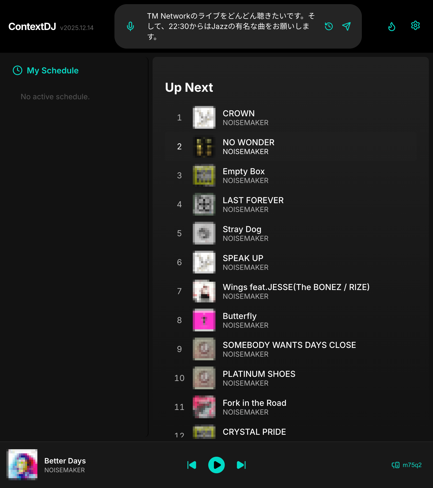
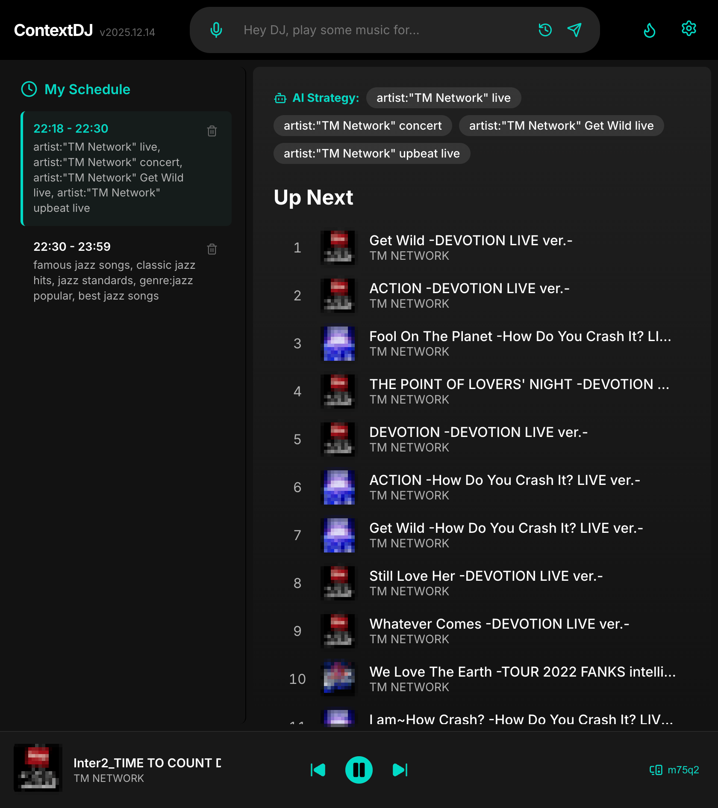
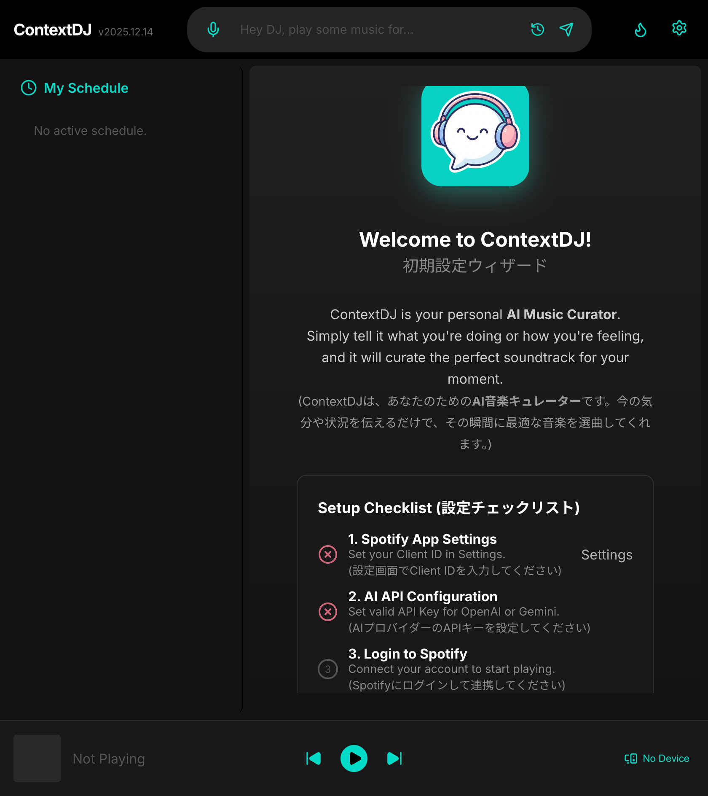
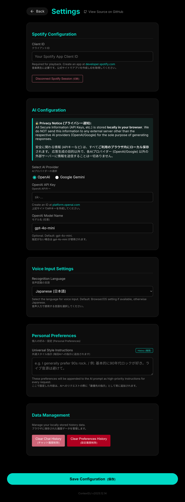

# ContextDJ


[日本語版はこちら (Japanese)](./README.ja.md)


**ContextDJ** - AI Music Curator. It turns your vague requests (e.g., "Play music that fits the mood of a walk by the sea. I want to listen to piano jazz from 11 PM.") into a perfectly curated scheduling of tracks.

Unlike standard shuffle or playlists, ContextDJ builds a **context-aware schedule**, mimicking a radio DJ that understands the flow of time and mood.

🌐 **Try it now:** [contextdj.remoteroom.jp](https://contextdj.remoteroom.jp/)



*(Screenshot: Inputting a request)*


*(Screenshot: Main player interface with AI-generated queue)*

## ✨ Key Features

- **🗣️ Natural Language Interface**: Just tell the DJ what you want to hear. No complex filters needed.
    - **🎙️ Voice Input**: Speak your request directly. Supports multiple languages (configurable in settings).
- **🧠 AI-Powered Curation**: Supports **OpenAI (GPT-4o)** and **Google Gemini** models to understand nuance and musical context.
- **🔒 Privacy First**: **Bring Your Own Key (BYOK)** architecture. Your API keys (OpenAI/Gemini/Spotify) are stored **locally in your browser** (localStorage). We never see your data.
- **🌊 Seamless Spotify Integration**: Connects with your Spotify Premium account on the web to play curated playlists on your devices (Spotify app on phone or PC).

## 🚀 Getting Started

### Prerequisites

To use ContextDJ (even the hosted version), you need:

1.  **Spotify Premium Account**: Required for the Web API playback controls.
2.  **Spotify Client ID**: You need to create a simple app in the [Spotify Developer Dashboard](https://developer.spotify.com/dashboard/applications).
    - Redirect URIs: `https://contextdj.remoteroom.jp/` (or `http://127.0.0.1:3000/` for local dev)
    - APIs used: `Web API`
3.  **AI API Key**: key from either [OpenAI](https://platform.openai.com) or [Google AI Studio](https://aistudio.google.com/).

### Setup Guide

1.  Go to [ContextDJ](https://contextdj.remoteroom.jp/). 
2.  Click the **Settings (⚙️)** icon in the top right. 
3.  Enter your **Spotify Client ID**.
4.  Enter your **AI API Key** (OpenAI or Gemini).
5.  Click **Save Configuration**.
6.  Return to the home page, type a prompt (e.g., *"Bright jazz for the afternoon, and winter a cappella for the night"*), and hit Send!

## 🛠️ Development

If you want to run ContextDJ locally or contribute:

1.  **Clone the repository**
    ```bash
    git clone https://github.com/mah-jp/context-dj.git
    cd context-dj
    ```

2.  **Install dependencies**
    ```bash
    npm install
    # or
    yarn install
    ```

3.  **Run the development server**
    ```bash
    npm run dev
    ```

4.  Open [http://127.0.0.1:3000](http://127.0.0.1:3000) with your browser.

## 📦 Tech Stack

- **Framework**: [Next.js](https://nextjs.org/) (App Router)
- **Language**: TypeScript
- **Styling**: CSS Modules (Custom Dark Theme)
- **State Management**: React Context API
- **APIs**:
    - Spotify Web API
    - OpenAI API / Google Gemini API

## 📄 Privacy Notice

ContextDJ is a **client-side application**.
- We allow you to input your sensitive API keys only to communicate directly with the respective services (Spotify, OpenAI, Google) from your browser.
- **No data is sent to our servers.** All configuration is persisted in your browser's `localStorage`.

## 🤝 License

This project is licensed under the MIT License - see the [LICENSE](LICENSE) file for details.
