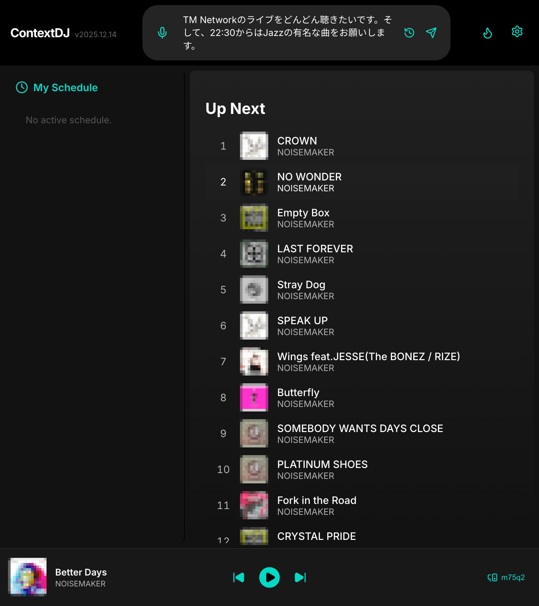
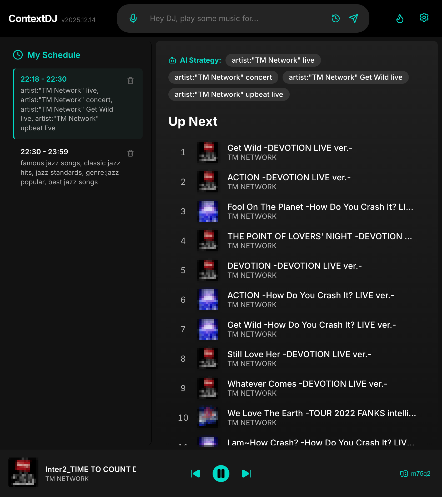
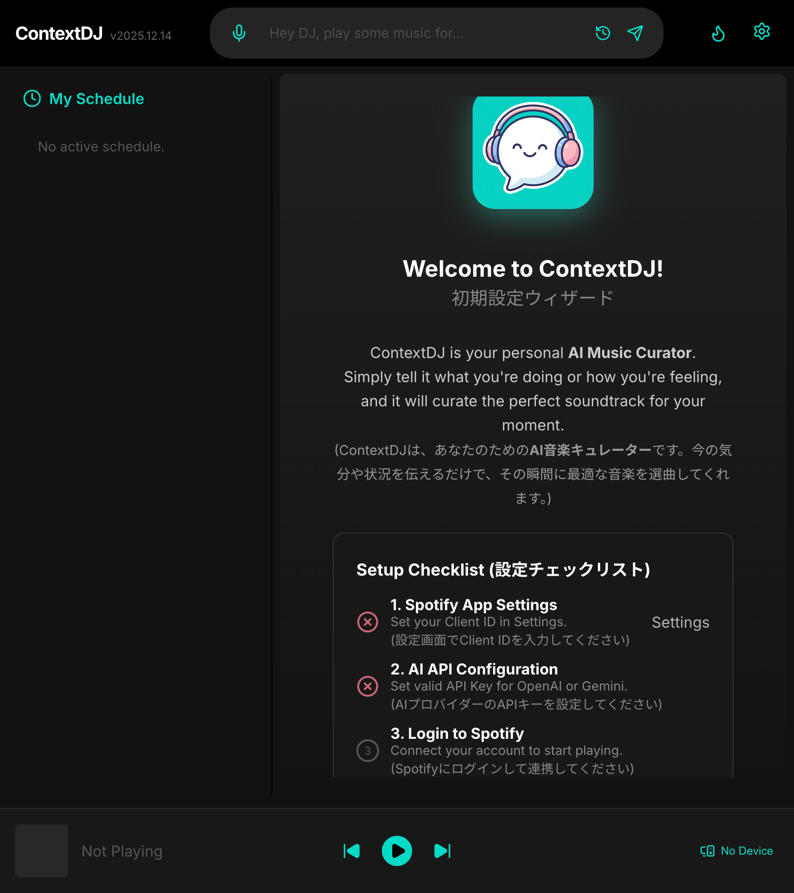
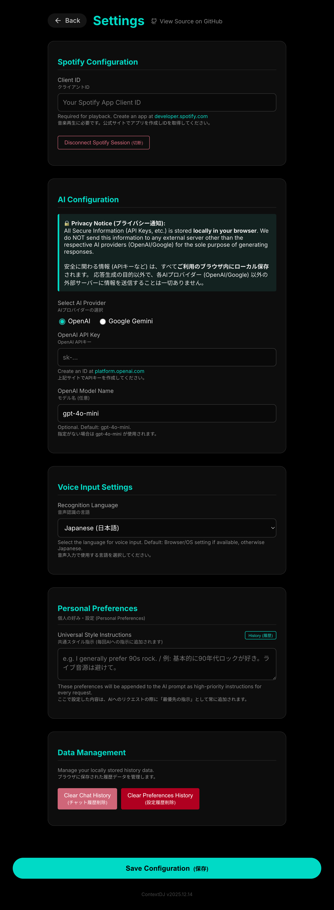

[ Languages: **English** | [日本語](README.ja.md) (Japanese) ]

# ContextDJ


**ContextDJ** - AI Music Curator. It turns your vague requests (e.g., "Play music that fits the mood of a walk by the sea. I want to listen to piano jazz from 11 PM.") into a perfectly curated scheduling of tracks.

Unlike standard shuffle or playlists, ContextDJ builds a **context-aware schedule**, mimicking a radio DJ that understands the flow of time and mood.

🌐 **Try it now:** [contextdj.remoteroom.jp](https://contextdj.remoteroom.jp/)



*(Screenshot: Inputting a request)*


*(Screenshot: Main player interface with AI-generated queue)*

## ✨ Key Features

- **📸 Context Vision**: Use your camera to "show" the DJ your environment. The AI analyzes visual context, artistic mood/lighting to suggest perfect soundtracks.
- **♻️ Context Recall**: Instantly re-summon past moods. Clicking archived schedule items lets you remix and reuse previous contexts.
- **✨ DJ Insight**: Real-time visibility into the AI's creative "train of thought," explaining why each track and transition was chosen.
- **🎯 AI Filtering**: An automated verification layer that ensures Spotify search results genuinely match your complex requests.
- **🥣 Auto-Refill (Okawari)**: An intelligent, endless loop that automatically generates new schedule items before the music stops.
- **🔒 Privacy First (BYOK)**: Direct client-to-service communication. Your API keys (Spotify, OpenAI, Gemini) never leave your browser.

## 🚀 Getting Started

### Prerequisites

To use ContextDJ (even the hosted version), you need:

1.  **Spotify Premium Account**: Required for the Web API playback controls.
2.  **Spotify Client ID**: You need to create a simple app in the [Spotify Developer Dashboard](https://developer.spotify.com/dashboard/applications).
    - Redirect URIs: `https://contextdj.remoteroom.jp/` (or `http://127.0.0.1:3000/` for local dev)
    - APIs used: `Web API`
3.  **AI API Key**: key from either [OpenAI](https://platform.openai.com) or [Google AI Studio](https://aistudio.google.com/).

### Setup Guide

1.  Go to [ContextDJ](https://contextdj.remoteroom.jp/). 
2.  Click the **Settings (⚙️)** icon in the top right. 
3.  Enter your **Spotify Client ID**.
4.  Enter your **AI API Key** (OpenAI or Gemini).
5.  Click **Save Configuration**.
6.  Return to the home page, type a prompt (e.g., *"Bright jazz for the afternoon, and winter a cappella for the night"*), and hit Send!

## 🛠️ Development

If you want to run ContextDJ locally or contribute:

1.  **Clone the repository**
    ```bash
    git clone https://github.com/mah-jp/context-dj.git
    cd context-dj
    ```

2.  **Install dependencies**
    ```bash
    npm install
    # or
    yarn install
    ```

3.  **Run the development server**
    ```bash
    npm run dev
    ```

4.  Open [http://127.0.0.1:3000](http://127.0.0.1:3000) with your browser.

## 🖥️ CLI / Terminal Version

A terminal-native CUI (TUI) dashboard is built into ContextDJ, allowing you to control playback and interact with the AI curator directly from your terminal. It provides real-time ASCII visualization of the playback schedule, currently playing track, DJ thoughts, and an interactive prompt.

### Launching

```bash
# Launch interactive TUI dashboard
npm run cli

# Launch and submit an initial music request directly
npm run cli -- "Chill beats for late night coding"

# Run interactive setup wizard
npm run cli -- setup
```

### Initial Authentication (Copy-Paste Method)
1. On first run, `npm run cli` displays an authorization URL in your terminal.
2. Open the URL in your local browser and approve the request.
3. Copy the redirected URL (`http://127.0.0.1:8888/callback?code=...`) from your browser's address bar and paste it into the terminal.
4. The obtained `refresh_token` is saved in `~/.config/context-dj/config.json` and refreshed silently in the background.
*(Note: Add `http://127.0.0.1:8888/callback` to the Redirect URIs in your Spotify Developer Dashboard).*

### CUI Controls

* **Request Input**:
  * `Enter`: Submit music request to trigger AI schedule curation and playback.
  * `↑` / `↓`: **Navigate request history**. Automatically restores unsaved draft inputs when returning to the bottom (persisted to `~/.config/context-dj/history.json`).
* **Quick Playback Controls (when input prompt is empty)**:
  * `Space`: Play / Pause toggle
  * `n`: Skip to next track
  * `p`: Go to previous track
  * `q` or `Ctrl+C`: Quit

## 📦 Tech Stack

- **Framework**: [Next.js](https://nextjs.org/) (App Router)
- **Language**: TypeScript
- **Styling**: CSS Modules (Custom Dark Theme)
- **State Management**: React Context API
- **APIs**:
    - Spotify Web API
    - OpenAI API / Google Gemini API

## 📄 Privacy Notice

ContextDJ is a **client-side application**.
- We allow you to input your sensitive API keys only to communicate directly with the respective services (Spotify, OpenAI, Google) from your browser.
- **No data is sent to our servers.** All configuration is persisted in your browser's `localStorage`.

## 🤝 License

This project is licensed under the MIT License - see the [LICENSE](LICENSE) file for details.
